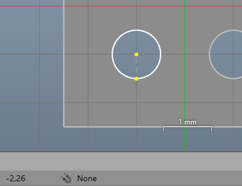
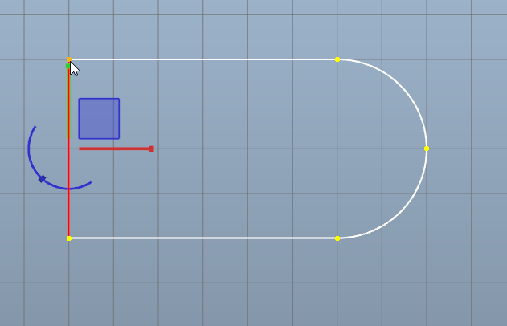
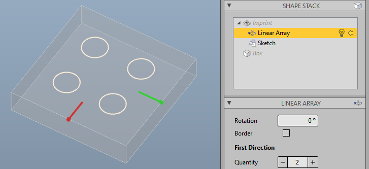

This page lists all new features and changes of the version 4.0 compared to the previous version.

## Snapping 

This release brings a significant extension to snapping. The basic system has been revised and the snapping functionality has been integrated into many tools and areas:

* **Live tools** now support snapping to vertices and edges where applicable.

* The sketch editor tool **SplitSegment** now supports snapping on grid, edge and segment intersections. If an intersection of segments is selected, both segments will be cut at this point.

* The sketch editor **moving tool** supports snapping on other edges, segments and vertices. 

* The **Status Bar** contains new information about snapping availability and, if snapped, the type and the element name snapped to.

^

## Modelling

* **[DatumPlane](xref:322f5cc2-0fc7-43f9-bb80-5e87cb3e3651)**: When assigning an image, you are asked whether the size of the plane should be adapted to the size specifications of the image if such metadata is stored in the image file.

* **[Cylinder](xref:5da4906e-c86b-4f91-8b30-f5163e152d1e)** does now support negative values for it's height.

* **[Reference](xref:55fc2982-4f52-4c9d-8e75-b1b100fd53b0)** has a new option to select the shape being referenced as being a fixed shape from the shape stack, or just always the top shape (default).

* **[Slice Contour](xref:0c834add-faf4-48f0-a8c3-e6dce411774c#cut-plan-slice-contour)** and **[Etching Mask](xref:0c834add-faf4-48f0-a8c3-e6dce411774c#etching-mask)**: The slicing can now work without having an opposite face to the base face, e.g. when the other side of the shape is not plane. The thickness will then be calculated using the farthest vertex position. However, for getting this to work, the base face has to be manually selected.

## Sketches

* **Polyline**: The continuous creation of segments was extended to the use of all possible segment types. The segment type to be used next can be changed while a polyline is being created. The context menu also allows fast switching between segment types.

^

* **Scaling**: There is a new tool in the sketch editor to scale segments.
  
* **Offset**: There is a new tool in the sketch editor to create an offset from segments. This works for closed wires as well as for open wires and individual segments.

* The sketch editor tool **SplitSegment** got a mouse cursor to indicate that the tool is active.

* **Keyboard shortcuts** has been defined for various sketch editor commands. Please refer to the new keyboard shortcut overview via <kbd>Ctrl</kbd><kbd>F1</kbd>.

* **Constraints** are hidden if element is moved or any other sketch tool is in use

* **Segment creation** can be cancelled by pressing the ribbon (or context menu) button a second time.

* Creating **rectangles** will not create constraints automatically anymore. The constraints can be created manually in the desired form after creation.

* **Points under constraint** will attempt to remain untouched when they are moved by the moving tool.

* The property panel of the shape stack and the selected shape is collapsed when in Sketch Editor.

* Sketches are checked for invalid point or segment references on load.

## Workspace

* Improved formatting of tool **hint messages** to increase the visibility of essential information.

* There is a new window for listing all **keyboard shortcuts** as a reminder. This window can be opened by the icon in the title bar or via shortcut <kbd>Ctrl</kbd><kbd>F1</kbd>.

* When setting sub-operands as current shape in the **shape stack**, in order to add or edit modifier, the predecessor shape of the top level of the stack is shown as ghost.

^

* Double Click with the mouse or pressing <kbd>E</kbd> will now start editing where an editor is available (e.g. Sketches, Chamfer, Fillet). If the modifier does not have an own editing and it's predecessor shape is a sketch, the sketch editor will be started.

* Seam edges will not be drawn on cylindrical and spherical faces anymore.

* The context menu now arranges it's alignment properly according screen bounds.

## Exchange

* New mesh export to the **glTF format** including export to binary version (GLB).

* **DXF import** now correctly interprets the bulge parameter of _LwPolyline_ entities.

* **Obj export and import** now transforms the vertices into the correct coordinate system.

## Scripting

* Upgraded to .Net 8 and C# 12.

* Consistent use of @Macad.Common.Color struct.

* Some API moved from @Macad.Core.Viewport class to @Macad.Interaction.ViewportController and from @Macad.Core.Workspace to @Macad.Interaction.WorkspaceController. Adjustments may be necessary here.

## Miscellaneous

* Improved **Pipe Drawing** dimensions

* Improved Compatibility with **Wine/Crossover**. See [article](xref:46793f6d-da23-48ea-913a-186727062a80) for more information.
