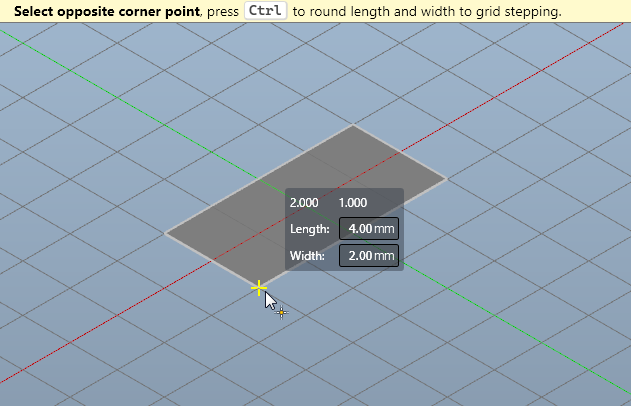
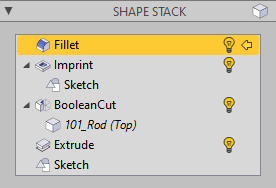
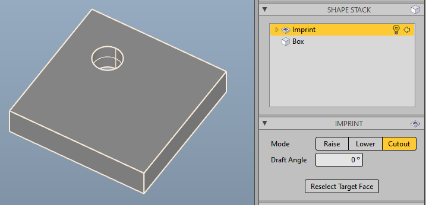
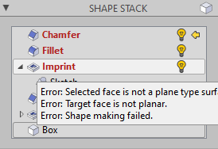

This page explains the main editing concepts.

## Tools and Actions

The modeling is done by adding modifiers, each of which carries out a further processing step on the shape. A number of _tools_ are available for this, which provide for interaction in the viewport. 

Tools are divided into individual processing phases, which are called _actions_. This can be the selection of a sub-shape, the definition of a point or other interactive activities. The tool shows which action is currently expected by a note at the top of the viewport.

Actions and tools can usually be canceled with the <kbd>Esc</kbd> key. While an action is running, additional information is often displayed next to the mouse pointer, e.g. the length/width/height when creating a box. Values that are displayed in an input field can also be entered manually using the keyboard. The input can be made without selecting the input field and is completed with the <kbd>Enter</kbd> key.

^

The properties of bodies, shapes and tools are displayed in the property pane and can be edited here. After creating a body or adding a modifier, its parameters are displayed here and can be added, refined or changed.

> [!TIP]
> Formulas can also be used in all input fields that expect numerical values. To do this, the entry is simply started with an equal sign. The color of the field indicates whether the formula can be interpreted correctly. The formula is evaluated immediately and not saved.

## The Shape Stack

For bodies, the shape stack is also displayed here. Here the modifier can be selected whose values are to be changed. The changes are then carried through the entire stack upwards. Operations on the shape stack are available via the context menu (right mouse button).

Shape stacks can become quite extensive if you incorporate additional shapes or bodies as operands. Then a sub-stack is created in the stack, which represents the processing of the operand shape.

^

Modifiers cannot be moved within the stack. However, they can be skipped or deleted entirely. New modifiers can also be inserted: To do this, the current shape pointer (yellow arrow) is set to the modifier that is to apply as the predecessor for the processing step to be inserted, and the new modifier is added as usual. This can also be done in sub-stacks.

^

## Errors

Modeling with a parametric system that offers full control over the history of a shape can also lead to errors. For example, a change in the shape stack can cause problems when finding sub-shapes, or an algorithm cannot work with the given shape or the parameters.

Unfortunately, in these cases the user is asked. To assist with troubleshooting, error messages are generated and displayed on the top of the viewport and in the tooltip of the faulty shape. In the _Messages_ window, all warning and error messages are also listed that arise when the individual shapes are generated. Here, too, additional information is presented if the mouse pointer rests on the error message for a moment. The error messages go away when the error is resolved.

^

Take a look at the error message and try to find the cause. Play with the parameters and see if something changes. Some algorithms have problems with certain constellations and complexities in the shape. Then you can consider whether the result can also be achieved using another construction method.
