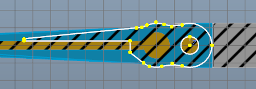

This page explains the Sketch and it's tools.

Sketches are 2D vector drawings which are used as templates for modifiers. They can be extruded or revolved to create solid shapes. They can also be applied to surfaces of existing bodies in order to be used as templates for e.g. punching or embossing.

Sketches consist of a series of curve segments that are clearly defined and delimited by points. Segments themselves are therefore parameterless. For example, a circle is not defined by the center and the radius, but by the center and a rim point. However, parameters can be mapped using constraints, which in this case attempt to achieve a certain radius. [Later more.](xref:0dc12d15-5450-460c-909b-f25ed1cf4b7e#constraints)

Sketches can also have construction lines. These can be included in the sketch editor as normal segments, but are hidden before being passed on to the modifier.

## Creating Sketches

Sketches can be created explicitly or implicitly. Explicitly means that a new body is created that contains the sketch. They can either be created in one of the three planes of the world space, or in the plane of a selected planar surface.

Some modifiers also implicitly generate sketches, e.g. [Imprint](xref:D3faf9Bf-849f-4612-b689-bd5f699e850d). After selecting the face, the required sketch is automatically generated and bound to the surface, i.e. always aligned with this, even if it changes.

## Sketch Editor

Sketches are edited in their own editor. As soon as this is started, the viewport changes to a two-dimensional view of the sketch plane. The grid is aligned with the sketch level and, if desired, the model is also cut in this level.

^

To create new segments, start the tools in the sketch editor. The segments are created by setting the points. If an existing point is selected, it is shared between the existing and the new segment. This is indicated by a circle around the point in question when the point is selected. If this is not desired, the zoom size can be changed to increase the distance to the existing point in question. As segments must always form a closed curve for proper further processing, this function is extremely important, as only shared points form a seamless transition between two segments.

When moving points, moved points can also be merged with other points. This is also shown by a circle around the point in question, but here a dialogue asks whether a merge should take place or not. 

## Constraints

Constraints are used to ensure certain requirements. These can refer to points, segments or both, individually or in relation to others. A constraint solver shifts the points after each change until all constraints can be fulfilled. 
To create constraints, select all points and segments involved and select the constraint from the ribbon bar. If there is a constraint parameter, it is displayed in the property pane. In the sketch editor view, constraints are shown with white symbols on a blue background.

> [!TIP]
> The solver can fail if too many constraints exist, constraints have conflicting requirements, or the numerical complexity becomes too high. 
> However, the constraint solver can also fail if the area in which points would have to be moved in order to fulfill all constraints becomes too large. In this case, it can help to support the solver and move the points close to the point that is likely to fulfill the constraints.

## Import and Export

There are specialized programs for more complex drawing tasks. In order to be able to exchange sketches with such programs, the sketch editor has an import and export functions for several 2D vector drawing file formats. The segments are saved in nearly the same way as possible in the sketch. However, as each file format has its own data definitions, the result may vary. The same applies to the import. Constraints are not exported or imported at all.

The SVG file format has a special position here: it can be exported directly to the windows clipboard and imported again from there. This enables a quick exchange with drawing programs that also support this (e.g. Inkscape).
