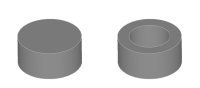
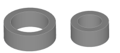
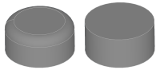

Create a solid or hollowed shape defined by a series of 2D sections provided by sketches.

## Properties

Start Capping
:   The capping mode of the start section. The following modes can be selected:
    * __None:__ The section will not be closed and a wall added to the lofted shape, so you will receive a hollowed out shape.
    * __Flat:__ The section will be closed with a flat capping. If both sides are closed, the shape will not be hollowed out.
    
    ^

End Capping
:   The capping mode of the end section. See _Start Capping_ for possible values.

Wall Thickness
:   Defines the wall thickness of the hollow shape.
    This parameter is only available if capping mode is _None_ for start or end capping.

Direction
:   The direction in which the shape is thickened to build the wall.
    * __Inwards:__ The sections describe the outer shape of the loft, and the wall is added to the inside.
    * __Outwards:__ The sections describe the inner shape of the loft, and the wall is added to the outside.

    This parameter is only available if capping mode is _None_ for start or end capping.
	^

Corner Type
:   Defines how the corners will be build if the shape is thickened. This is typically only relevant for convex corners in _Outwards_ mode and accordingly for concave corners in _Inwards_ mode.
    The possible values are:
	* __Round:__ The corners are created using circular edges.
    * __Angular:__ The corners are created using the extension of the adjacent faces.
    
	This parameter is only available if capping mode is _None_ for start or end capping.
	^

## Remarks
The order of the sections will be determined automatically by minimizing distances between all sections.

Only one contour can be used per section. If the sketch consists of more than one contour, the first is used and the others ignored.

While lofts can be built using open or closed contours, they cannot be mixed. So the contours of all sections need to be closed or open.

When creating a hollow shape — meaning at least one of the two end caps is set to_None_ — the system first generates the solid body. Then, an offset shape is created inside it, based on the specified wall thickness. For this to work correctly, all edges that connect the input sketches must maintain the same continuity (smoothness and type of transition) along their entire length.

> [!CAUTION]
> If there is a change in continuity — for example, if a sharp corner in one sketch becomes a rounded curve in the next — the algorithm cannot handle it and will stop with an error message: _Mixed Connectivity_. 

If you run into this issue, you can solve it by editing the sketch that contains the rounded segment. Split the segment at the point where it should align with a corner in the other sketch, and manually insert a corner there instead. 
Alternatively, you can set the capping mode to _Flat_ and build another loft to hollow it out using boolean cut.

## Creating a Loft
A loft can be created on any sketch shape by adding more sketches to define the hull of the loft.
1. Select one or more sketches.
2. Select __Loft__ from ribbon menu. If you have selected more than one sketch, the shape is finished using this two shapes. Otherwise, you can now add another sketches to the loft.
3. Select another sketch to add it to the loft. You can add as many sketches as you need. Press __Escape__ to leave the adding mode.

> [!NOTE]
>  The order of addition is not important for the algorithm to work, but it will define the order the sketches are listed in the modifier stack.
