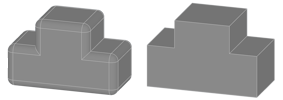

Makes a sketch or solid thicker or thinner by creating parallel copies of each curve or face at a specified distance and closing the resulting gaps.

## Properties
Distance
:   Defines the distance between the new boundary and the initial one. A positive distance makes the shape thicker, a negative distance narrows the shape.
    ^

Corner Type
:   Specifies how gaps between the faces are filled at the edges where the faces move apart.
    * __Round:__ The gaps will be filled with round faces to connect the faces. This also applies to gaps caused by negative distance in concave corners.
    * __Angular:__ Closes the gaps by attempting to continue the original Faces up to their cutting edge.

    ^

Keep Original
:   _Only for sketch type bodies._
    If checked, the original shape will be included in the result. Otherwise, the result will only contain the offset version.

## Remarks
For offset operation on sketches, it is mandatory that the segments must be closed.

## Creating an Offset
An offset can be created on any sketch or solid shape.

1. Select the solid or sketch to scale.
2. Select __Offset__ from ribbon menu.
3. Adjust the distance in the property panel or using the live tools.
